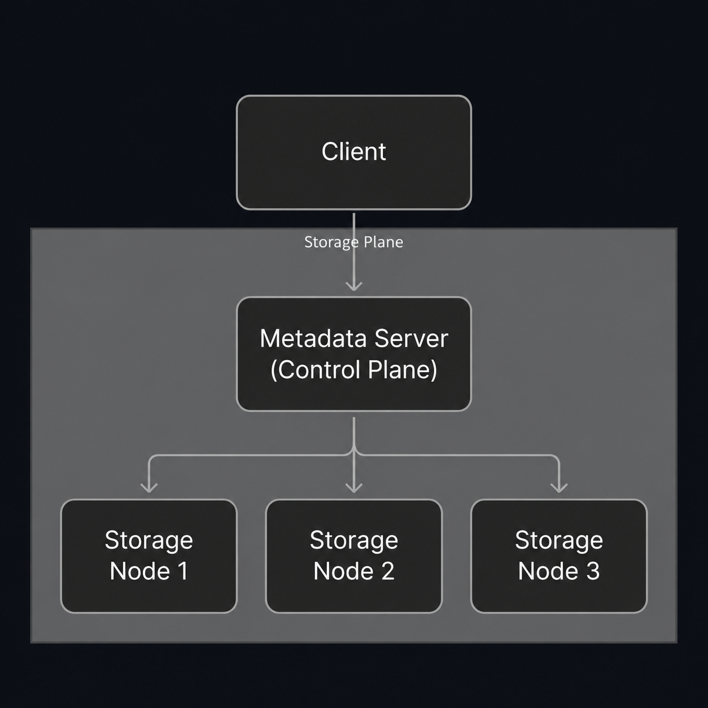
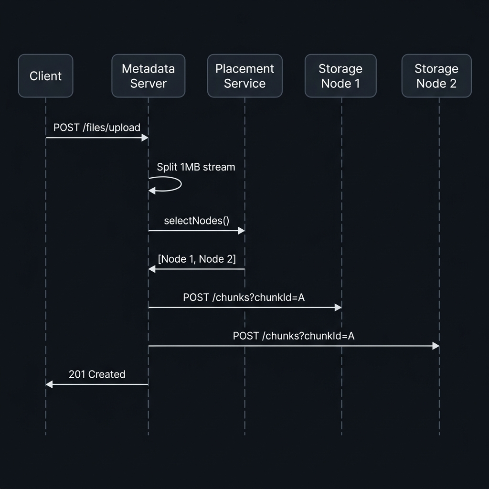

# TitanFS Architectural Layout

This document describes the logical layout and write sequence flow of the TitanFS Distributed File Storage System.

---

## 1. Logical Cluster Architecture



---

## 2. Dynamic Streaming Chunk Upload & Replication Sequence

This sequence diagram details the lifecycle of a client file write. The metadata server segments the file stream on the fly and replicates the blocks across healthy storage nodes.



---

## 3. Dynamic Telemetry & Auto-Registration Loop

To keep capacity metrics completely up-to-date and maintain a zero-config setup, the storage nodes run a dynamic scheduling thread:

```text
+-----------------------+              +-----------------------+
|  Storage Node (8082)  |              |    Metadata Server    |
+-----------------------+              +-----------------------+
            |                                      |
            |-- 1. Inspect Filesystem Usable Space |
            |                                      |
            |-- 2. Check Local Chunks Count        |
            |                                      |
            |------------- POST /nodes/register -->|
            |              (Node ID, Host, Port)   |
            |                                      |
            |<------------ Registration OK --------|
            |                                      |
            |-- 3. Loop: POST Heartbeat (10s) ---->|
            |            (Pass freeSpace)          |
```
