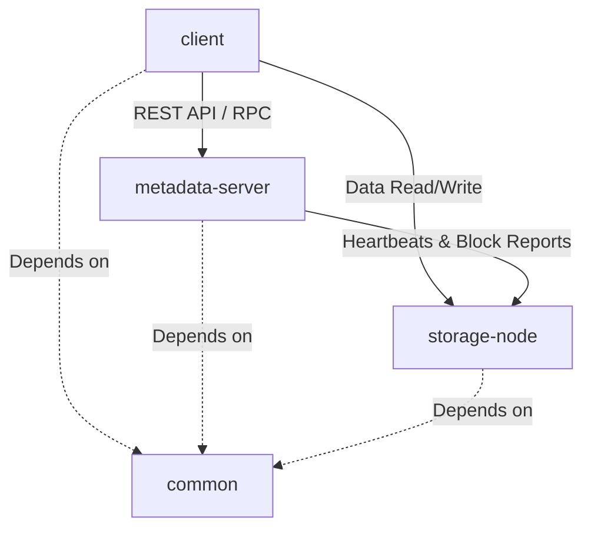

# Technical & Architecture Decisions: Distributed File Storage System (TitanFS)

This document records the foundational architectural decisions and technical choices made during the initial setup of **TitanFS**, a custom distributed file storage system. The goal of this document is to provide deep, interview-ready rationales explaining *why* specific technologies and design patterns were chosen.

---

## 1. Modular Architecture Overview

A distributed storage system naturally requires separate actors performing distinct roles across different nodes. TitanFS is divided into four modules under a single parent project:

### Module Roles:
1. **`parent` (Root POM)**: Manages cross-cutting plugin configurations, sets default compiler parameters, and centralizes Spring Boot dependency management.
2. **`common`**: A pure Java library containing core abstractions, shared DTOs (Data Transfer Objects), error/exception definitions, packet/message payloads, and cryptographic/hashing utilities.
3. **`metadata-server`**: The system master. It maintains the hierarchical filesystem namespace (directories and files), chunk/block layouts (mapping file paths to block IDs), and records storage node health via heartbeats.
4. **`storage-node`**: The worker node. It manages local disk storage, reads/writes file blocks, and coordinates block replication.
5. **`client`**: A CLI tool or software library that clients use to upload/download files, chunking files locally and talking directly to storage nodes for data transfer after resolving metadata.

### Rationale:
* **Separation of Concerns**: Decoupling the storage engine (`storage-node`) from the control plane (`metadata-server`) prevents state leakage and allows each service to scale independently.
* **Network & Serialization Consistency**: By housing shared serialization formats and DTOs in `common`, we guarantee that if we modify the message format, compilation fails across all dependent modules if they are not updated. This provides compile-time safety for our custom network protocol.

---

## 2. Technology Stack & Runtime Decisions

### Java 21 (LTS)
We chose **Java 21** as the baseline runtime version.
* **Virtual Threads (Project Loom)**: A distributed file system is highly I/O-bound. Traditionally, dealing with thousands of concurrent client uploads/downloads required either complex asynchronous reactive programming (WebFlux) or high thread overhead. Virtual Threads allow us to write simple, synchronous, thread-per-request code that scales to millions of concurrent requests with negligible memory footprints.
* **Pattern Matching & Record Patterns**: Ideal for processing different types of incoming packet packets/commands in the networking layer with minimal boilerplate.
* **Sequenced Collections**: Provides structured collections for tracking chronological block access (e.g. LRU block caching).

### Spring Boot 3.5.16
* **Why Spring Boot?**: We use Spring Boot to bootstrap the HTTP REST APIs of the control plane (`metadata-server`) and the worker nodes (`storage-node`). It provides out-of-the-box support for database connections (JPA/Hibernate), JSON serialization, config profiles, and testing.
* **Why HTTP for control plane, TCP/direct I/O for data?**:
  * The `metadata-server` handles relatively low-bandwidth CRUD operations (querying file locations, logging directories) where JSON/HTTP is highly readable and standardized.
  * *Design note*: In future iterations, we may implement a high-performance raw TCP socket protocol or gRPC for block transfers inside `storage-node` to avoid HTTP overhead.

### PostgreSQL & Spring Data JPA (Metadata Server)
* **Relational Storage for Metadata**: File storage systems require strict consistency for their directory namespace structure and block lookup maps. Storing file hierarchies and chunk-to-node allocations requires tabular, highly indexable, ACID-compliant transactions. PostgreSQL provides:
  * Fast indexing on search paths.
  * Row locking to prevent conflicting file modifications.
  * Relational mappings (`@OneToMany` file-to-chunks, node tracking) using Hibernate.

---

## 3. Build & Dependency Management Design

We structured the Maven configuration using a **Nested Multi-Module Parent** layout.

### Rationale for Parent POM Inheritance:
* **Single Source of Truth**: The root `pom.xml` acts as the parent and inherits from `spring-boot-starter-parent`. Submodules like `storage-node` and `metadata-server` refer to the root `pom.xml` as their `<parent>`.
* **Centralized Versioning**: We declare the Spring Boot parent version once at the root POM. This ensures there are zero version mismatches (e.g., mismatched Jackson or Hibernate versions) between the metadata server and storage nodes.
* **Shared Plugins**: Common compile configurations, such as standard Java compiler targets and annotation processors like **Lombok**, are declared once.

---

## 4. Key Dependencies & Utilities

1. **Lombok**:
   * **Why**: Minimizes boilerplate code for DTOs, logs, builder patterns, and constructors. In a distributed codebase, writing dozens of getter/setter methods for packets and configuration structures detracts from readability.
2. **Spring Boot DevTools**:
   * **Why**: Included in `storage-node` for automatic restarts during local multi-node configuration tuning.
3. **PostgreSQL Driver**:
   * **Why**: The metadata server links directly to a PostgreSQL database for persistent node state tracking and namespace trees.
