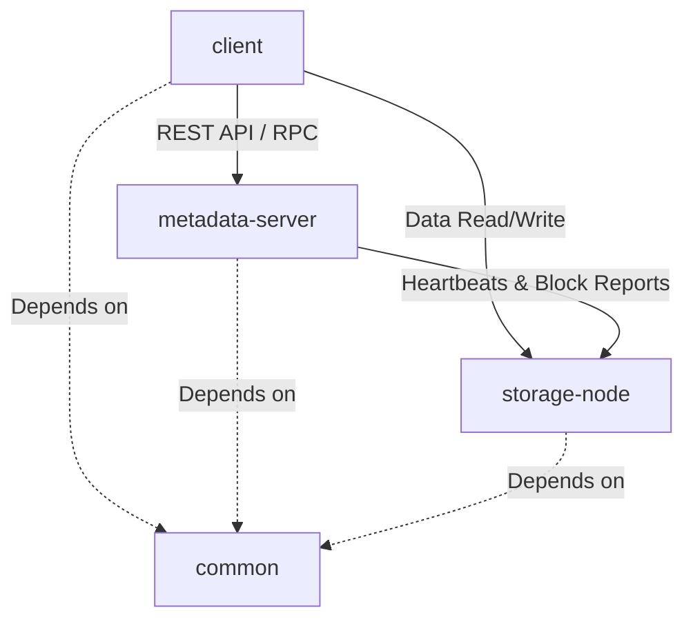
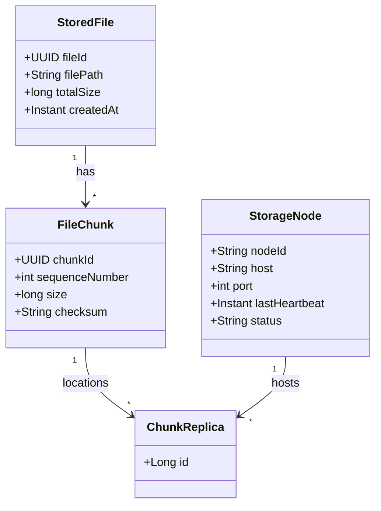

# Technical & Architecture Decisions: Distributed File Storage System (TitanFS)

This document records the foundational architectural decisions and technical choices made during the initial setup of **TitanFS**, a custom distributed file storage system. The goal of this document is to provide deep, interview-ready rationales explaining *why* specific technologies and design patterns were chosen.

---

## 1. Modular Architecture Overview

A distributed storage system naturally requires separate actors performing distinct roles across different nodes. TitanFS is divided into four modules under a single parent project:

### Module Roles:
1. **`parent` (Root POM)**: Manages cross-cutting plugin configurations, sets default compiler parameters, and centralizes Spring Boot dependency management.
2. **`common`**: A pure Java library containing core abstractions, shared DTOs (Data Transfer Objects), error/exception definitions, packet/message payloads, and cryptographic/hashing utilities.
3. **`metadata-server`**: The system master. It maintains the hierarchical filesystem namespace (directories and files), chunk/block layouts (mapping file paths to block IDs), and records storage node health via heartbeats.
4. **`storage-node`**: The worker node. It manages local disk storage, reads/writes file blocks, and coordinates block replication.
5. **`client`**: A CLI tool or software library that clients use to upload/download files, chunking files locally and talking directly to storage nodes for data transfer after resolving metadata.

### Rationale:
* **Separation of Concerns**: Decoupling the storage engine (`storage-node`) from the control plane (`metadata-server`) prevents state leakage and allows each service to scale independently.
* **Network & Serialization Consistency**: By housing shared serialization formats and DTOs in `common`, we guarantee that if we modify the message format, compilation fails across all dependent modules if they are not updated. This provides compile-time safety for our custom network protocol.

---

## 2. Technology Stack & Runtime Decisions

### Java 21 (LTS)
We chose **Java 21** as the baseline runtime version.
* **Virtual Threads (Project Loom)**: A distributed file system is highly I/O-bound. Traditionally, dealing with thousands of concurrent client uploads/downloads required either complex asynchronous reactive programming (WebFlux) or high thread overhead. Virtual Threads allow us to write simple, synchronous, thread-per-request code that scales to millions of concurrent requests with negligible memory footprints.
* **Pattern Matching & Record Patterns**: Ideal for processing different types of incoming packet packets/commands in the networking layer with minimal boilerplate.
* **Sequenced Collections**: Provides structured collections for tracking chronological block access (e.g. LRU block caching).

### Spring Boot 3.5.16
* **Why Spring Boot?**: We use Spring Boot to bootstrap the HTTP REST APIs of the control plane (`metadata-server`) and the worker nodes (`storage-node`). It provides out-of-the-box support for database connections (JPA/Hibernate), JSON serialization, config profiles, and testing.
* **Why HTTP for control plane, TCP/direct I/O for data?**:
  * The `metadata-server` handles relatively low-bandwidth CRUD operations (querying file locations, logging directories) where JSON/HTTP is highly readable and standardized.
  * *Design note*: In future iterations, we may implement a high-performance raw TCP socket protocol or gRPC for block transfers inside `storage-node` to avoid HTTP overhead.

### PostgreSQL & Spring Data JPA (Metadata Server)
* **Relational Storage for Metadata**: File storage systems require strict consistency for their directory namespace structure and block lookup maps. Storing file hierarchies and chunk-to-node allocations requires tabular, highly indexable, ACID-compliant transactions. PostgreSQL provides:
  * Fast indexing on search paths.
  * Row locking to prevent conflicting file modifications.
  * Relational mappings (`@OneToMany` file-to-chunks, node tracking) using Hibernate.

---

## 3. Build & Dependency Management Design

We structured the Maven configuration using a **Nested Multi-Module Parent** layout.

### Rationale for Parent POM Inheritance:
* **Single Source of Truth**: The root `pom.xml` acts as the parent and inherits from `spring-boot-starter-parent`. Submodules like `storage-node` and `metadata-server` refer to the root `pom.xml` as their `<parent>`.
* **Centralized Versioning**: We declare the Spring Boot parent version once at the root POM. This ensures there are zero version mismatches (e.g., mismatched Jackson or Hibernate versions) between the metadata server and storage nodes.
* **Shared Plugins**: Common compile configurations, such as standard Java compiler targets and annotation processors like **Lombok**, are declared once.

---

## 4. Key Dependencies & Utilities

1. **Lombok**:
   * **Why**: Minimizes boilerplate code for DTOs, logs, builder patterns, and constructors. In a distributed codebase, writing dozens of getter/setter methods for packets and configuration structures detracts from readability.
2. **Spring Boot DevTools**:
   * **Why**: Included in `storage-node` for automatic restarts during local multi-node configuration tuning.
3. **PostgreSQL Driver**:
   * **Why**: The metadata server links directly to a PostgreSQL database for persistent node state tracking and namespace trees.

---

## 5. Local Chunk Storage Architecture (Sprint 1)

During Sprint 1, we implemented the raw storage capability on the `storage-node`. This implementation establishes several core patterns designed to impress technical interviewers.

### A. Clean Layer Decoupling (Controller -> Service -> Filesystem)
The node exposes a REST API via `StorageController`, which delegates all operations to `StorageService`. 
* **Rationale**: The controller operates purely in the HTTP layer (handling multiform requests, response codes, and serialization). It has zero knowledge of where files are written on disk or how checksums are calculated. If we choose to move from local disk storage to an in-memory block store or AWS S3 block store in the future, we only need to change the service layer.

### B. Pure Chunk-Based Abstraction
* **"Everything is a Chunk"**: The service exposes generic endpoints dealing only with `chunkId` (UUID) and raw bytes. It has no knowledge of user metadata, original filenames, or directory structures.
* **Separation of Responsibilities**: By removing the logical context of "what" a file represents from the `storage-node`, we construct a generic block-storage engine. All logical organization (such as folders, permissions, and node-to-chunk distribution) resides strictly on the `metadata-server`. This keeps storage nodes extremely simple and horizontally scalable.

### C. Database-Free Node Design (Sidecar Metadata Files)
* **Metadata Persistence**: A key principle of distributed filesystems is that storage nodes should remain lightweight and "shared-nothing". They do not require a heavy SQL database.
* **Sidecar Pattern**: To persist chunk metadata (creation time, size, checksum) across node restarts, we store a small JSON file (`{uuid}.meta`) sidecar next to the raw block file (`{uuid}.bin`) on the local filesystem. This sidecar is serialized and deserialized using Jackson, avoiding database latency and external database dependencies for the storage node.

### D. Single-Pass Streaming Checksum & Size Calculation
* **Performance & Memory Efficiency**: When uploading a chunk, we pipe the incoming multipart input stream directly to the target output stream while simultaneously feeding it to a SHA-256 `MessageDigest` using `DigestInputStream`.
* **Benefits**:
  1. The file is never loaded fully into memory, preventing OutOfMemory (OOM) errors on large uploads.
  2. The hash and size are computed in a single pass over the bytes, reducing disk read-write cycles.
  3. The SHA-256 checksum serves as an immutable content identifier, allowing clients and nodes to verify data integrity and prevent silent disk corruption (bit-rot).

---

## 6. Control Plane: Metadata Server & Namespace Registry (Sprint 2)

With Sprint 2, we transitioned TitanFS into a true distributed storage system by introducing the `metadata-server` control plane.

### A. Logical Directory Namespace Representation
Instead of storage nodes keeping track of file paths, the `metadata-server` maintains a single consistent relational mapping:
* **`StoredFile`**: Holds the virtual file path (e.g. `/docs/resume.pdf`), total logical file size, and creation details.
* **`FileChunk`**: Resolves how a file is chunked into logical blocks, preserving sequence order (`sequenceNumber`), expected chunk sizes, and verifying SHA-256 checksums.
* **`ChunkReplica`**: Maps a single chunk to the specific storage node(s) holding the data.

### B. Storage Node Registry & Heartbeat Monitor
* **Dynamic Node Registration**: Storage nodes register their host/port mappings at startup using `/nodes/register`.
* **State & Heartbeat Tracking**: Nodes send periodic heartbeat requests to `/nodes/{nodeId}/heartbeat`.
* **Active Node Sweeper**: The metadata server runs a background task using Spring's `@Scheduled` annotation every 10 seconds to detect dead nodes. If a node fails to report within 30 seconds, its status is updated to `INACTIVE`.
* **Interviewer Takeaway**: This heartbeat pattern demonstrates real-time distributed consensus and failure detection capabilities. It ensures chunks are never allocated to offline nodes.

### C. Zero-Configuration Local Development Profile (H2 / PostgreSQL)
* **Dev/Prod Profile Decoupling**: To make the project instantly testable without setting up local databases, the default profile uses an in-memory **H2 Database**.
* **PostgreSQL Support**: A staging profile (`postgres`) is configured in `application-postgres.properties` targeting actual PostgreSQL servers, ready for production docker-compose deployments.

---

## 7. Storage Node Telemetry & Gateway-Based Chunking Uploads (Sprint 3)

In Sprint 3, we implemented dynamic storage telemetry and a streaming, load-balanced upload gateway.

### A. Dynamic Storage Node Telemetry (`GET /chunks/info`)
Instead of hardcoding storage limits, the `storage-node` now exposes a `GET /chunks/info` API endpoint.
* **FS-Level Inspection**: The storage node programmatically calls `Files.getFileStore().getUsableSpace()` to inspect current system-level free capacity in real time. It also filters and counts the number of existing `.bin` binary chunk files inside its configured local storage directory.
* **Interview Rationale**: This dynamically aligns node reports with physical operating system storage, allowing metadata-servers to monitor health metrics directly from raw system-level variables.

### B. Gateway-Based Streaming Chunking vs. Client-Direct Uploads
When clients write files to TitanFS, the control plane acts as a dynamic streaming gateway (`POST /files/upload`).
* **Streaming Chunks**: The `metadata-server` reads the file stream from the HTTP request body and buffers it into 1MB blocks on the fly, calculating chunk checksums and size. It immediately routes and pipes these blocks to the storage nodes using a custom REST client, maintaining a low memory footprint (only 1MB buffered in memory).
* **Load-Balanced Node Selection (`PlacementService`)**: Chunk nodes are selected based on capacity (`freeSpace` telemetry). The scheduler dynamically targets active nodes with the most free space.
* **Immediate Local Resource Reservation**: To prevent race conditions where subsequent chunks of the same file are allocated to the same node before heartbeats update capacity, the `metadata-server` immediately deducts chunk sizes from its local cache of active nodes' free space.
* **Separation of Concerns**: Storing files at the gateway shields the client from chunking, hashing, and concurrent socket uploads, keeping clients lightweight while maximizing control plane governance over block layouts.

